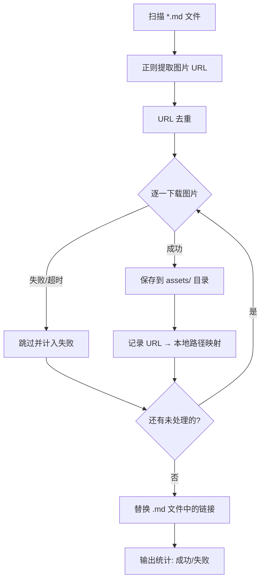

# 📥 Markdown 远程图片本地化工具

[](https://www.python.org/)
[](LICENSE)
[]()

自动扫描当前目录下所有 `.md` 文件，将其中的远程图片下载到本地 `assets/` 目录，并自动替换 Markdown 中的图片链接为本地相对路径。

---

## 📋 目录

- [功能特性](#功能特性)
- [依赖环境](#依赖环境)
- [快速开始](#快速开始)
- [使用方法](#使用方法)
- [工作原理](#工作原理)
- [运行示例](#运行示例)
- [常见问题](#常见问题)
- [项目结构](#项目结构)
- [许可证](#许可证)

---

## 功能特性

- 🔍 **自动扫描** — 遍历脚本所在目录的所有 `.md` 文件
- 🖼️ **智能提取** — 匹配 `` 格式的远程图片链接（支持 HTTP/HTTPS）
- ♻️ **URL 去重** — 同一图片 URL 在多篇文档中出现时只下载一次，避免重复
- 📝 **按文档命名** — 图片文件以对应文档名为前缀，如 `你的笔记_001.png`
- 🧩 **格式识别** — 根据服务器返回的 `Content-Type` 自动设置正确扩展名（png/jpg/gif/webp）
- 🔗 **链接替换** — 下载完成后自动将远程 URL 替换为 `assets/xxx.png` 本地路径
- ⚡ **纯标准库** — 无需安装任何第三方包，开箱即用

### 支持的图片格式

| Markdown 语法 | 是否支持 |
| --- | :---: |
| `` | ✅ |
| `` | ✅ |
| `` | ✅ |
| `` | ❌ |

---

## 依赖环境

- **Python 3.6+**

全部使用 Python 标准库（`re`、`os`、`glob`、`urllib`、`ssl`），**无需额外安装任何第三方包**。

---

## 快速开始

```bash
# 1. 克隆仓库
git clone https://github.com/你的用户名/MarkDownImgUrlToLocal.git
cd MarkDownImgUrlToLocal

# 2. 将脚本放到你的笔记目录下（或把 .md 文件放到脚本目录下）
cp download_images.py ~/你的笔记目录/

# 3. 运行脚本
cd ~/你的笔记目录/
python download_images.py
```

---

## 使用方法

### 1. 准备工作

确保 `download_images.py` 和你的 `.md` 文件在同一个目录下：

```
你的笔记目录/
├── download_images.py      ← 脚本文件
├── 项目介绍.md              ← 包含远程图片链接的 md 文件
├── 技术文档.md
├── 会议记录.md
└── assets/                 ← 图片存放目录（首次运行自动创建）
```

### 2. 运行脚本

```bash
python download_images.py
```

### 3. 执行效果

运行后脚本会：
1. 扫描所有 `.md` 文件并提取远程图片 URL
2. 去重后逐个下载图片到 `assets/` 目录
3. 将 `.md` 文件中的远程链接替换为本地相对路径

---

## 工作原理



---

## 运行示例

```
共找到 4 个 md 文件
  项目介绍.md: 找到 5 张图片
  技术框架.md: 找到 10 张图片
  部署指南.md: 找到 8 张图片
  问题记录.md: 找到 3 张图片

去重后共 23 张图片需要下载
[1/23] 正在下载: 项目介绍_001.png... 成功 (12345 bytes) -> 项目介绍_001.png
[2/23] 正在下载: 项目介绍_002.png... 成功 (23456 bytes) -> 项目介绍_002.png
...
[23/23] 正在下载: 问题记录_003.jpg... 成功 (5678 bytes) -> 问题记录_003.jpg

已更新: 项目介绍.md
已更新: 技术框架.md
已更新: 部署指南.md
已更新: 问题记录.md

完成! 成功: 23, 失败: 0
```

---

## 常见问题

<details>
<summary><b>Q: 为什么有些图片下载失败？</b></summary>

可能的原因：
- 图片链接已失效或需要登录才能访问
- 网络连接超时（默认 30 秒）
- 服务器屏蔽了爬虫请求

目前脚本已配置了常见的浏览器 `User-Agent`，并禁用了 SSL 证书验证，兼容大部分图床（包括飞书等自签名证书服务）。如果仍然失败，可以检查失败的具体错误信息。
</details>

<details>
<summary><b>Q: 支持哪些 Markdown 图片格式？</b></summary>

仅支持标准 Markdown 图片语法 ``。如果文档中使用的是 HTML `` 标签，脚本不会处理。
</details>

<details>
<summary><b>Q: 同一张图片出现在多篇文档中会怎样？</b></summary>

脚本会对 URL 进行去重，只下载一次。本地文件名以**首次扫描到的文档名**为前缀，后续文档中的相同 URL 都会替换为同一个本地路径。
</details>

<details>
<summary><b>Q: 可以不生成 assets 文件夹，直接在 md 同级目录放图片吗？</b></summary>

目前图片统一放在 `assets/` 子目录中。如需修改，可在脚本中调整 `assets_dir` 变量。
</details>

<details>
<summary><b>Q: 图片下载后扩展名不对怎么办？</b></summary>

脚本会根据 HTTP 响应的 `Content-Type` 头自动判断扩展名（支持 png/jpg/gif/webp）。如果服务器返回的类型不准确，可能会导致扩展名错误。此时图片内容本身是完整的，手动重命名即可。
</details>

---

## 项目结构

```
MarkDownImgUrlToLocal/
├── download_images.py      ← 核心脚本
├── README.md               ← 项目说明文档
└── LICENSE                 ← 开源许可证（MIT）
```

---

## 许可证

本项目采用 [MIT License](LICENSE) 开源许可证。你可以自由使用、修改和分发本项目的代码。

---

## ⭐ 支持项目

如果这个工具对你有帮助，欢迎给个 Star ⭐ 支持一下！
